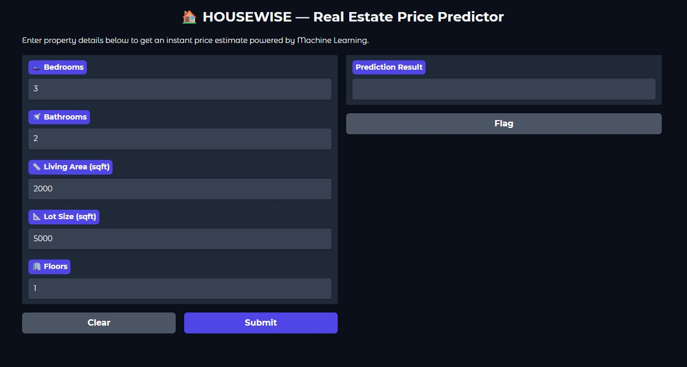
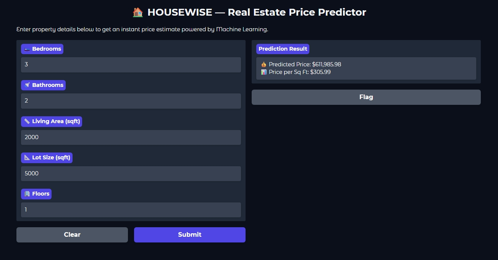

# 🏠 HOUSEWISE — Real Estate Price Predictor

A machine learning system that predicts residential property prices instantly — built on 21,613 real house transactions from King County, Seattle. Enter 5 property details, get an instant data-driven price estimate through an interactive web interface.

---

## 🌐 Web Interface

**Input Form — Enter property details:**


**Prediction Output — Instant price estimate:**


---

## 📌 Project Overview

Traditional property valuation relies on agent expertise and manual comparisons — inconsistent, time-consuming, and prone to human bias. HOUSEWISE replaces guesswork with a data-driven ML pipeline that covers the full lifecycle: raw data → EDA → feature engineering → model training → evaluation → deployed web application.

---

## 🏆 Model Performance

| Metric | Linear Regression | Random Forest |
|--------|------------------|---------------|
| R² Score (Test) | 0.49 | **0.53** |
| RMSE | ~$272,080 | **~$266,541** |
| MAE | ~$175,000 | **~$160,103** |
| MAPE | ~33% | **~31.38%** |
| **Selected** | ❌ | ✅ **Final Model** |

> Random Forest Regressor selected as the final model — outperformed Linear Regression across all four metrics.

---

## ✨ What's Covered

- 📥 Data loading and inspection — 21,613 rows, 21 columns
- 📊 Exploratory Data Analysis — price distribution, correlation heatmap, scatter plots
- ⚙️ Feature engineering — 5 key features selected from 21 available columns
- 📐 Data preparation — 80/20 train-test split, StandardScaler normalization
- 🤖 Model training — Linear Regression (baseline) vs Random Forest (final)
- 📈 Model evaluation — R², RMSE, MAE, MAPE comparison
- 💾 Model persistence — saved with Pickle for reuse without retraining
- 🌐 Web deployment — interactive Gradio interface for non-technical users

---

## 🔍 Key Insights

| Finding | Detail |
|---------|--------|
| Strongest predictor | `sqft_living` — highest correlation with price |
| Bathrooms > Bedrooms | Bathrooms have stronger price impact than bedroom count |
| Price distribution | Right-skewed — most houses priced between $200K–$800K |
| Mean price | $540,088 |
| Median price | $450,000 |

---

## 💡 Sample Predictions

| Bedrooms | Bathrooms | Living Area | Lot Size | Floors | Predicted Price |
|----------|-----------|-------------|----------|--------|----------------|
| 3 | 2 | 2,000 sqft | 5,000 sqft | 1 | $625,777 |
| 5 | 3.5 | 3,500 sqft | 8,000 sqft | 2.5 | $1,110,857 |
| 8 | 4 | 6,000 sqft | 10,000 sqft | 5 | $1,800,413 |

---

## 📊 Dataset

- **Source:** King County House Sales Dataset — Kaggle
- **Records:** 21,613 residential property transactions
- **Region:** Seattle, Washington, USA
- **Features:** 21 columns — property attributes, sale prices, location details
- **Target Variable:** `price` (house sale price in USD)

---

## 🛠️ Tech Stack


---

## 📁 Project Structure

```
HOUSEWISE/
├── data/                              # King County house sales dataset
├── images/                            # EDA plots and visualizations
├── models/                            # Saved model and scaler (pickle)
├── screenshots/
│   ├── interface_without_result.jpg   # Gradio input form
│   └── interface_with_result.jpg      # Gradio prediction output
├── Housewise.ipynb                    # Main ML notebook
└── README.md                          # Project documentation
```


---

## 🚀 How to Run

**1. Clone the repository**
```bash
git clone https://github.com/shubhamjais04/HOUSEWISE.git
cd HOUSEWISE
```

**2. Install dependencies**
```bash
pip install pandas numpy scikit-learn matplotlib seaborn gradio jupyter
```

**3. Open the notebook**
```bash
jupyter notebook Housewise.ipynb
```

**4. Run all cells in order**

**5. Launch the Gradio web interface**

The last cell in the notebook launches the interactive web app — open the local URL in your browser and start predicting prices instantly.

---

## 👨‍💻 Author

**Shubham Jaiswal**   
*ML engineer | Building data-driven tools that bring transparency to real-world decisions*

---

## 📬 Connect

[](https://linkedin.com/in/shubhjais04)
[](https://github.com/shubhamjais04)
[](mailto:shubhjais.in@gmail.com)
[](https://www.kaggle.com/shubhamjaiswal04)


